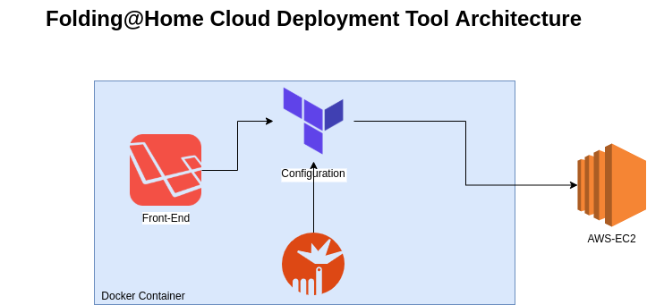

# fahcd
Cloud Deployment Tool for Folding@Home project

* Contributors are more than welcome!

* [Objectives](https://github.com/arpanadhikari/fahcd/blob/master/objectives.md)

This project aims to build a simple tool to deploy multiple F@H worker clients on different cloud platforms. 
Initially we plan to support AWS platform and expand to other providers.

This is a not-for-profit project solely aimed at playing a small part in this huge fight against emerging pandemics (covid-19 in this specific case).

To learn more about Folding@Home project, please visit [here](https://foldingathome.org/covid19/) .

Namaste (yeah, no handsakes).

Planned architecture:

